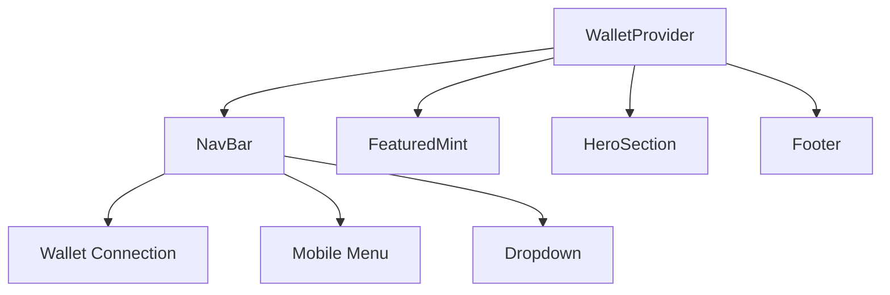
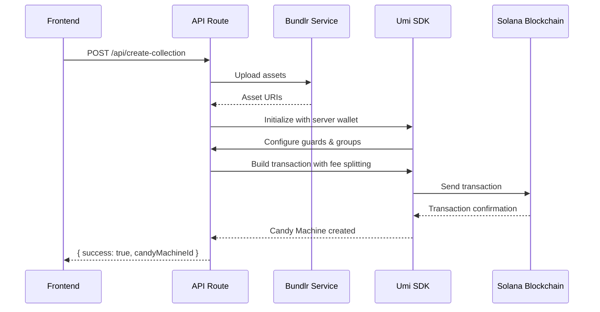

# Zuno Architecture Documentation

## Overview

Zuno is a web application built with Next.js that provides a platform for minting and managing digital assets. The application features a responsive navigation bar, wallet integration, and various sections for displaying featured mints, hero content, and other features.

## Key Components

### 1. WalletProvider

The `WalletProvider` component is responsible for managing wallet connections and providing wallet-related functionality throughout the application. It uses the `@solana/wallet-adapter-react` library to establish connections to Solana wallets and manage wallet states.

```typescript
export const WalletProvider: FC<WalletProviderProps> = ({ children }) => {
  const network = WalletAdapterNetwork.Devnet;
  const endpoint = useMemo(() => clusterApiUrl(network), [network]);

  const wallets = useMemo(
    () => [
      new PhantomWalletAdapter(),
      new SolflareWalletAdapter({ network }),
    ],
    [network]
  );

  return (
    <ConnectionProvider endpoint={endpoint}>
      <SolanaWalletProvider wallets={wallets} autoConnect>
        <WalletModalProvider>{children}</WalletModalProvider>
      </SolanaWalletProvider>
    </ConnectionProvider>
  );
};
```

### 2. NavBar

The `NavBar` component provides navigation functionality and wallet connection management. It includes responsive design elements for both desktop and mobile views, and integrates with the wallet system to display connection status and provide disconnection functionality.

```typescript
export default function NavBar() {
  const [mobileMenuOpen, setMobileMenuOpen] = useState(false);
  const [dropdownOpen, setDropdownOpen] = useState(false);
  const dropdownRef = useRef<HTMLDivElement>(null);

  const { publicKey, wallet, disconnect, connecting } = useWallet();
  const { setVisible } = useWalletModal();

  // Handle clicking outside of dropdown to close it
  useEffect(() => {
    function handleClickOutside(event: MouseEvent) {
      if (dropdownRef.current && !dropdownRef.current.contains(event.target as Node)) {
        setDropdownOpen(false);
      }
    }

    document.addEventListener('mousedown', handleClickOutside);
    return () => {
      document.removeEventListener('mousedown', handleClickOutside);
    };
  }, []);

  // Function to truncate wallet address
  const truncateAddress = (address: string) => {
    return `${address.slice(0, 4)}...${address.slice(-4)}`;
  };

  // Function to handle wallet connection
  const handleConnectWallet = () => {
    setVisible(true);
  };

  // Function to handle wallet disconnection
  const handleDisconnect = () => {
    disconnect();
    setDropdownOpen(false);
  };

  return (
    <nav className="w-full py-3 sm:py-4 px-3 sm:px-4 md:px-6 lg:px-8">
      {/* Navigation content */}
    </nav>
  );
}
```

### 3. FeaturedMint

The `FeaturedMint` component displays featured mint items on the homepage. It provides a visually appealing section that highlights key mints or collections.

```typescript
export default function FeaturedMint() {
  return (
    <section className="w-full py-8 sm:py-10 md:py-12 bg-white rounded-t-3xl">
      {/* Featured mint content */}
    </section>
  );
}
```

### 4. HeroSection

The `HeroSection` component provides the main hero section of the homepage, typically featuring a prominent headline, call-to-action, and other key information.

```typescript
export default function HeroSection() {
  return (
    <section className="w-full py-12 md:py-20 lg:py-24 relative overflow-hidden">
      {/* Hero section content */}
    </section>
  );
}
```

### 5. Footer

The `Footer` component provides the footer section of the application, typically containing links to important pages, copyright information, and other relevant details.

```typescript
export default function Footer() {
  return (
    <footer className="w-full py-6 md:py-8 bg-zuno-blue">
      {/* Footer content */}
    </footer>
  );
}
```

## Component Interactions

The components in the Zuno application interact in the following ways:

1. **WalletProvider**: The `WalletProvider` component wraps the entire application, providing wallet context to all child components. This allows any component to access wallet information and functionality.

2. **NavBar**: The `NavBar` component uses the wallet context provided by `WalletProvider` to display the connection status and provide wallet-related actions. It also manages the mobile menu and dropdown states.

3. **FeaturedMint, HeroSection, Footer**: These components are primarily responsible for displaying content and do not directly interact with the wallet system. However, they are part of the overall user interface and contribute to the user experience.

## System Architecture Diagram



This diagram illustrates the high-level architecture of the Zuno application, showing how the `WalletProvider` component interacts with other key components to provide wallet functionality and manage the application's user interface.

## Backend API Architecture

### Create Collection API (`/api/create-collection`)

The backend API provides a comprehensive endpoint for creating NFT collections with Candy Machine deployment on Solana Devnet.

#### Key Components

1. **Environment Configuration** (`src/config/env.ts`)
   - Centralized configuration management
   - Environment variable validation
   - Default values for development

2. **Bundlr Service** (`src/lib/bundlr.ts`)
   - Asset upload to decentralized storage
   - File and JSON upload capabilities
   - Balance management and node funding

3. **API Route** (`src/app/api/create-collection/route.ts`)
   - POST endpoint for collection creation
   - Multipart form data handling
   - Transaction building and execution
   - Comprehensive error handling

#### Flow Description



#### Fee Splitting Mechanism

The API implements a sophisticated fee splitting system:

- **Creator Revenue**: Mint price (e.g., 0.111 SOL) goes to creator's wallet
- **Platform Fee**: Fixed 1.25 USDT equivalent in SOL goes to platform wallet
- **Devnet MVP**: Uses hardcoded SOL value for platform fee
- **Production Ready**: Designed to fetch live SOL/USDT prices from oracles

#### Guard Configuration

The system supports multiple mint phases with different guard types:

- **AllowList Guards**: For OG/WL phases with merkle root verification
- **StartDate Guards**: For timed phase transitions
- **SolPayment Guards**: With split destination configuration

#### Error Handling

Comprehensive error handling includes:
- Validation errors (400 Bad Request)
- Upload failures (502 Bad Gateway)
- Transaction failures (500 Internal Server Error)
- Proper error messages without exposing sensitive data

#### Testing

Test endpoints available at `/api/create-collection/test`:
- Successful response simulation
- Error response simulation
- Validation error simulation
- Sample request/response documentation

## Security Considerations

- Server wallet private key stored in environment variables
- Input validation for all API parameters
- Secure key handling with bs58 encoding
- Proper error message sanitization
- CORS configuration for cross-origin requests